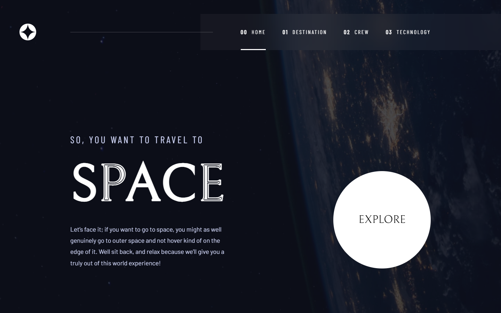

# Frontend Mentor - Space tourism website solution

This is a solution to the [Space tourism website challenge on Frontend Mentor](https://www.frontendmentor.io/challenges/space-tourism-multipage-website-gRWj1URZ3). Frontend Mentor challenges help you improve your coding skills by building realistic projects.

## Table of contents

- [Frontend Mentor - Space tourism website solution](#frontend-mentor---space-tourism-website-solution)
	- [Table of contents](#table-of-contents)
	- [Overview](#overview)
		- [The challenge](#the-challenge)
		- [Screenshot](#screenshot)
		- [Links](#links)
	- [My process](#my-process)
		- [Built with](#built-with)
		- [What I learned](#what-i-learned)
		- [Continued development](#continued-development)
	- [Author](#author)
	- [Commands](#commands)

## Overview

### The challenge

Users should be able to:

- View the optimal layout for each of the website's pages depending on their device's screen size
- See hover states for all interactive elements on the page
- View each page and be able to toggle between the tabs to see new information

### Screenshot

### Links

- Solution URL: [Add solution URL here](https://www.frontendmentor.io/solutions/space-tourism-multipage-website-hub-with-astro-and-react-SkmB9UDr5)
- Live Site URL: [Add live site URL here](https://space-tourism-website-viniciuscosta89.vercel.app)

## My process

### Built with

- Semantic HTML5 markup
- CSS custom properties
- Flexbox
- CSS Grid
- Mobile-first workflow
- [Astro](https://astro.build) - Static Site Generator
- [React](https://reactjs.org) - React framework
- [TypeScript](https://www.typescriptlang.org) - Types
- [BEM](http://getbem.com/introduction/) - CSS methodology
- [Sass](https://sass-lang.com) - For styles
- [Swiper](https://swiperjs.com) - For JS/React sliders

### What I learned

How to work with Astro. I really liked its ".astro" for pages, layouts and components.

It was a way to remember React and keep studying it, Typescript as well.

Sass + BEM still are a great combination.

### Continued development

I want to make just one Slider and create props for each variant.

## Author

- Frontend Mentor - [@viniciuscosta89](https://www.frontendmentor.io/profile/viniciuscosta89)
- GitHub - [@viniciuscosta89](https://github.com/viniciuscosta89)
- LinkedIn - [@viniciuscosta89](https://www.linkedin.com/in/viniciuscosta89)

## Commands

All commands are run from the root of the project, from a terminal:

| Command           | Action                                       |
| :---------------- | :------------------------------------------- |
| `yarn install`     | Installs dependencies                        |
| `yarn dev`     | Starts local dev server at `localhost:3000`  |
| `yarn build`   | Build your production site to `./dist/`      |
| `yarn preview` | Preview your build locally, before deploying |
